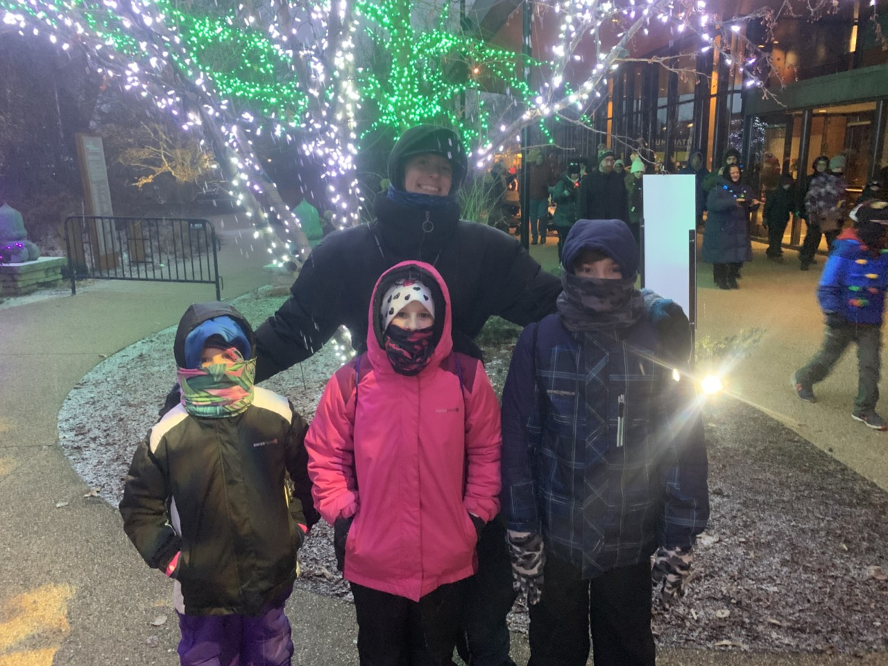
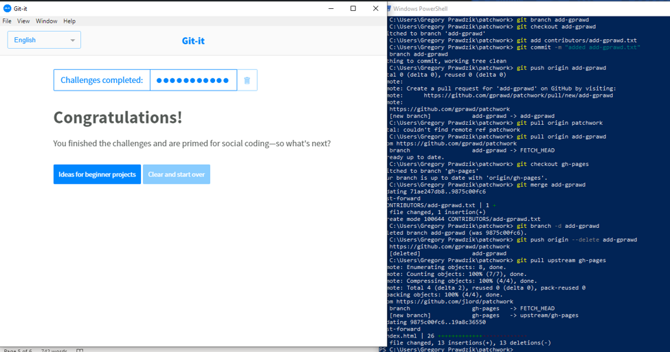

# Greg Prawdzik

## Where are you from?

Born in Chicago, moved to Lockport at 15, then to Joliet at 25.

## IT Interest

I am interested in creating things in IT.  I have an Associates from COD in Software Development.  I was a Network Operations Intern at Hub International for the previous 6 months.

## Something Interesting About You

I was a Combat Advisor/Combat Medic in the Army for 12 years, Firefighter/Paramedic for 12 years, and a Financial Advisor for 5 years before switching to IT.

## Git tutorial

