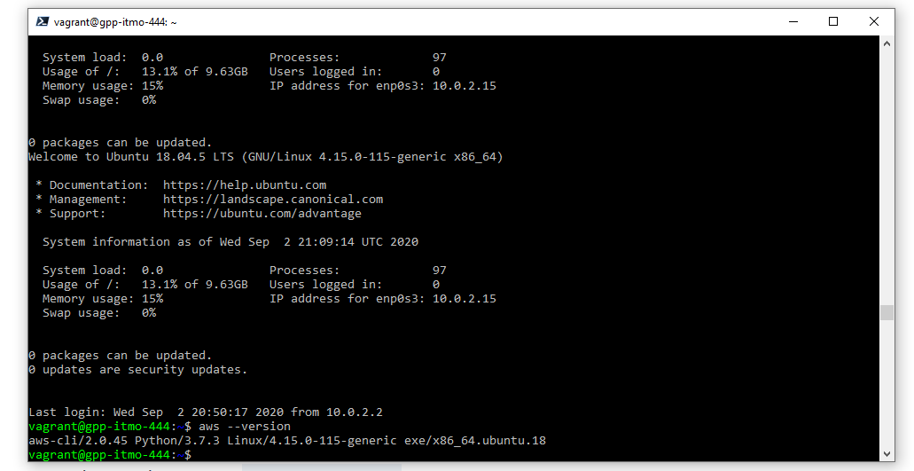

# Week-02 Lab Assignment

## Part 1

Using Vagrant, you will initialize a Vagrant Box for Ubuntu 18.04.5 -- `ubuntu/bionic64`, this virtual machine will be used for the remainder of the class for course work.   In this Vagrant Box you will add the following:

* Change the hostname to a hostname that includes: your initials and the course.  
  * For example:  jrh-itmo-444
* Install the [AWS CLI version 2 for Linux](https://docs.aws.amazon.com/cli/latest/userguide/install-cliv2-linux.html "AWS CLI v2 for Linux") tools in the Vagrant Box
  * Screenshot the output of the command: `aws --version`
  * Only one screenshot is needed to show both deliverables

## Part 2

* Upon successfully created and AWS account, using the IAM (Identity and Access Management), create a non-root account for use during this class.  
  * Take a screenshot of the management console of you logged into this non-root account

## Part 3

* Once the AWS CLI tools are installed, using AWS credentials you will launch an EC2 instance via the AWS CLI tools
  * Screenshot the command to launch the EC2 instance
  * Screenshot the command to check the status of the EC2 instance (Show it is running)
  * Screenshot the command to destroy the EC2 instance
  * Screenshot the command to check the status of the EC2 instance (Show it is terminating or terminated)

## Deliverable

Use this document as a template and provide the requisite screenshots below the items above.  Create a folder named: week-02 in your class provided repository under the folder for this class (itmo-444 or itmo-544)  submit to Blackboard just the URL to the Readme.md document
